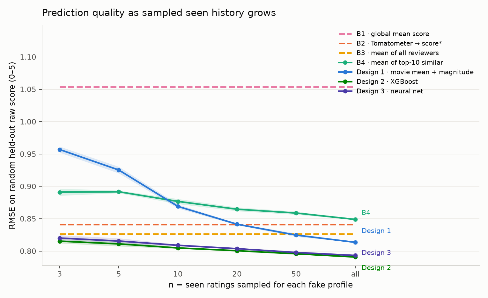

# Critic-Matched Movie Prediction

## Letterboxd community-rating project

The repository contains two intentionally isolated, visually parallel movie
prediction projects. Rotten Tomatoes predicts a critic-like 0–5 score from
professional reviews; Letterboxd predicts a member-like 1–10 score from other
members. They never share raw data, processed parquet files, or trained model
artifacts.

| | Rotten Tomatoes | Letterboxd |
|---|---|---|
| rater population | professional critics | Letterboxd members |
| target scale | parsed to 0–5 | native 1–10 |
| Design 1 | analytic critic match | analytic member match |
| Design 2 | 38-feature XGBoost | member/movie-statistic XGBoost |
| Design 3 | trained neural ensemble | code present, intentionally untrained |
| interactive catalog | 1,000 popular films | 1,000 popular films in Streamlit |

Download `ratings_export.csv` and `movie_data.csv` from the supplied Kaggle
dataset into `data/letterboxd/raw/`, then run from `src/`:

```bash
python -m letterboxd.preprocess
python -m letterboxd.train_analytic
python -m letterboxd.train_xgboost
python -m letterboxd.train_neural  # prints a deliberate no-training message
```

The downloaded export yielded 11,078,045 ratings from 7,420 members with at
least five ratings across 286,069 films. The requested 100k, 1M, and 10M scale
checks all complete in under 30 seconds but resolve to that complete local
population—the source has fewer eligible members than the smallest cap.

Current Letterboxd artifacts are isolated in `results/letterboxd/`: Design 1
records a 1.695 RMSE on 300 deterministic held-out member profiles with 50 seen
films; Design 2 records a 1.628 RMSE on 1,435 member-disjoint held-out ratings.
Those numbers are not directly comparable to RT RMSE because Letterboxd uses a
1–10 target and a different evaluation population. The Streamlit app has a
project selector and a fully interactive 1–10 Letterboxd catalog. The static
website has the matching project selector, methodology, and current results;
its existing browser prediction engine remains RT-only until a compact
Letterboxd browser export is added.

For the full project-specific workflow and leakage notes, see
[`src/letterboxd/README.md`](src/letterboxd/README.md).

This project predicts a user's standardized 0-5 movie rating from professional
critic scores. It offers three designs: an explicit movie-mean-centered
analytic formula, a saved XGBoost model, and a saved neural network, both
trained on repeated fake-user profiles.

Each design lives in its **own self-contained package** under `src/`
(`design1_analytic/`, `design2_xgboost/`, `design3_neural/`): the pseudo-user
substrate and feature construction are duplicated verbatim inside each so a
reader can study one design end-to-end without chasing a shared module. The
copies are identical and seeded, so the three designs are compared on
byte-identical episodes; see [DOCUMENTATION.md](DOCUMENTATION.md) §1 for the
full layout.

There are no real user histories in the source data. Each eligible critic is
therefore treated as a pseudo-user: sampled ratings become movies they have
seen, while one different rated movie becomes an unseen target. This is an
all-time item-holdout protocol, not a 2022 cutoff. It lets the app score any
unseen movie in its catalog, regardless of release year.

**Data funnel** (start -> used -> app):

| stage | count |
|---|---|
| raw review rows | 1,444,963 |
| distinct critics with a parseable score | 8,623 |
| after the low-volume floor (>5 scored reviews) | 4,393 critics, 1,262,747 rows |
| parsed, standardized scored reviews used for modelling | 992,954 |
| distinct movies with any scored review | 58,736 |
| neighbour pool / pseudo-users (>=10 distinct movies) | 3,704 critics |
| movies in the final app catalog (most-reviewed) | 1,000 |
| critics appearing in that catalog | 3,387 |

## Random Fake Users

The all-time matrix includes 3,715 critics with at least 10 scored reviews;
3,704 have at least 10 distinct movies and can form pseudo-user episodes. (The
floor was lowered from 20 to 10 to widen the critic pool; the extra
low-volume critics contribute where they overlap but rarely dominate a match.)
Critic identities are deterministically split into 2,592 train, 556 validation,
and 556 test pseudo-users.

**Paired, nested evaluation.** An earlier version sampled a fresh random target
for every seen-count `n`, which made even the n-independent baselines wobble
column to column and left the curves looking noisy. The evaluation is now
paired: for each test pseudo-user with more than 50 movies, a fixed set of 8
target movies is chosen once; for each target and each of 3 redraws, the
remaining movies are placed in one popularity-weighted order, and the seen set
at seen-count `n` is the first `n` of that order (all of them for `n = all`).
Because the target and the seen order are fixed across the whole grid, **every
seen-count -- and every baseline -- is scored on an identical
(user, target, draw) set.** The seen-independent baselines are therefore
exactly flat and the model curves are smooth (41,472 paired test episodes).
Design 1, the XGBoost model, and the neural network are all scored on
byte-identical episodes, generated once by a shared, deterministic routine.

For `n = all`, one target is withheld and every other rated movie is seen. The
target never enters the pseudo-user's similarity input or the target movie's
reviewer mean. Other critics' ratings of that movie are catalog evidence. This
evaluates unseen-item prediction, not chronological forecasting of unreleased
films.

## Formula and Terms

Every parseable critic score is standardized to `{0, 1, 2, 3, 4, 5}`. That raw
standardized score is the target for both models.

For pseudo-user `u`, critic `c`, and their shared seen movies `O[u, c]`,
Pearson correlation is:

```text
rho[u, c] =
  sum over i in O[u, c] of
    (r[u, i] - r_bar[u, O]) * (r[c, i] - r_bar[c, O])
  ----------------------------------------------------------------
  sqrt(sum over i of (r[u, i] - r_bar[u, O])^2) *
  sqrt(sum over i of (r[c, i] - r_bar[c, O])^2)
```

- `r[u, i]` and `r[c, i]` are user and critic standardized scores for shared
  movie `i`.
- `r_bar[u, O]` and `r_bar[c, O]` are their respective means over the same
  overlap set.
- `rho[u, c]` ranges from `-1` for opposite score movement to `+1` for matching
  movement.

Small overlaps are shrunk toward zero:

```text
s[u, c] = rho[u, c] * min(n_overlap[u, c], k) / k
```

`n_overlap[u, c]` is the count of shared seen movies. The refreshed validation
sweep selected `k = 8`; `abs(s[u, c])` is unsigned similarity magnitude.

The rating-magnitude multiplier is:

```text
g[u, c] = sum over i in O[u, c] of r[u, i] * r[c, i]
          -----------------------------------------------
          sum over i in O[u, c] of r[c, i]^2
```

`g[u, c]` is `mag_sim` in code. If a user's overlap ratings equal
`1.25 * critic_rating`, then `g[u, c] = 1.25`.

For target movie `m`, let `C[m]` be its other reviewers and let `r_bar[m]` be
their unweighted mean rating. The analytic prediction is:

```text
r_hat[u, m] =
  sum over c in C[m] of
    (abs(s[u, c]) * r_bar[m] + s[u, c] * (r[c, m] - r_bar[m])) * g[u, c]
  -------------------------------------------------------------------------
                    sum over c in C[m] of abs(s[u, c])
```

`r_hat[u, m]` is clipped to `[0, 5]`. The denominator intentionally excludes
`g[u, c]`. If every target reviewer has zero similarity, the app falls back to
the movie mean `r_bar[m]`.

The processed data also retain a diagnostic z-score:

```text
z[c, i] = (r[c, i] - mu[c]) / sigma[c]
```

`mu[c]` and `sigma[c]` are critic `c`'s all-time mean and standard deviation.
The active models use raw standardized scores, not z-scores.

## Results

- **B1 global mean:** all-time mean standardized score.
- **B2 Tomatometer -> score:** Tomatometer is the percentage of Fresh reviews,
  not a mean rating. A linear mapping converts it to 0-5; absent values fall
  back to the reviewer mean.
- **B3 reviewer mean:** `r_bar[m]`.
- **B4 top-10 similar mean:** unweighted mean from up to ten most positively
  aligned target reviewers.
- **RMSE:** `sqrt(sum((prediction - held_out_rating)^2) / N)`. Lower is better.

- **Design 2 XGBoost** and **Design 3 neural net:** gradient-boosted trees
  and a residual neural-network ensemble, trained on the same repeated
  fake-user profiles (32 per critic and seen-count, ~437k rows) over the
  **same 38 features** (decile summaries of `sim x (critic score - peer mean)`,
  plus `user_mean`, `tomatometer`, dispersion, and counts). The network uses
  all 37 numeric features plus a genre embedding.

RMSE on the 41,472 paired, nested held-out episodes (identical films for every
column, so the baselines are exactly flat):

| seen ratings `n` | 3 | 5 | 10 | 20 | 50 | all |
|---|---:|---:|---:|---:|---:|---:|
| B1 global mean | 1.054 | 1.054 | 1.054 | 1.054 | 1.054 | 1.054 |
| B2 Tomatometer -> score | 0.841 | 0.841 | 0.841 | 0.841 | 0.841 | 0.841 |
| B3 reviewer mean | 0.827 | 0.827 | 0.827 | 0.827 | 0.827 | 0.827 |
| B4 top-10 similar mean | 0.891 | 0.892 | 0.877 | 0.865 | 0.859 | 0.849 |
| Design 1 formula | 0.957 | 0.925 | 0.869 | 0.842 | 0.825 | 0.814 |
| Design 2 XGBoost | 0.815 | 0.811 | 0.805 | 0.801 | 0.796 | **0.791** |
| Design 3 neural net | 0.820 | 0.816 | 0.809 | 0.804 | 0.798 | 0.793 |



Reading the curve:

- The **baselines are flat** (paired evaluation), and Design 1 falls smoothly
  and monotonically from 0.957 at `n = 3` to 0.814 at full history, crossing
  the flat aggregates near `n = 50`. The earlier wobble was target-sampling
  noise, not model behaviour.
- The two **trained models beat every baseline at every `n`** and are
  statistically tied with each other: XGBoost 0.803 overall / 0.791 full
  history, the neural net 0.807 / 0.793. The network is a genuine deep model
  (six residual blocks of width 512, ~3M weights, a 3-network ensemble trained
  on the Apple GPU over 2x the training data) and still does **not** beat the
  trees. Scaling it up -- wider, deeper, more epochs, more fake-user data --
  moved the loss by nothing: on this engineered tabular feature set the ceiling
  is set by the information in the features, not model capacity. Reported
  honestly rather than tuned to manufacture a difference.
- Both trained models improve only gently with `n` because their strongest
  feature is the movie's Tomatometer (about 11x the next feature), followed by
  `user_mean`; the history-dependent similarity features add a smaller, real
  correction. That is why the learned loss is as low as it is -- it is a
  calibrated movie consensus, verified free of target leakage (peer means are
  leave-one-out and the pseudo-user is excluded everywhere).

Stratified by critic disagreement (full history), all three methods beat the
Tomatometer in every tercile; the trained models most, including on
high-disagreement films (XGBoost +5.1%, neural net +4.8% there).

## Website

Live at **[ap-gautham.github.io/palate](https://ap-gautham.github.io/palate/)**,
built with Vite + React + TypeScript (`web/`) and hosted as a static GitHub
Pages site from `docs/` -- no server. All three models run **client-side in
the browser**: the analytic formula is plain arithmetic, the XGBoost model is
a from-scratch JSON tree-walker (`web/src/lib/xgboost.ts`), and the neural
net is a hand-written forward pass (`web/src/lib/neuralnet.ts`) over the
ensemble's raw weights, exported by `src/web_export/export.py`. The port is
checked against the Python `predict.py` outputs in `web/scripts/validate.ts`
(the analytic formula matches to float precision; the trained models agree to
within ~0.02 on the 0-5 scale, from an unstable-sort tie-break -- see the
comment in `web/src/lib/features.ts`).

A separate Streamlit app (`app/streamlit_app.py`) reproduces the same UI
against the original Python inference code, for local use:

```bash
.venv/bin/streamlit run app/streamlit_app.py
```

Both apps hold the same catalog of the **1,000 most-reviewed movies** (3,387
critics appear in them). A sort control orders the search lists alphabetically
(default), by year, or by most reviewed. Both have three sections:

1. **Films you have seen** -- a search box adds a film to a table; each row has
   a five-star widget (click a star, it and all before it light up gold, and
   the rating shows beside it), the search box clears after each add, and rows
   can be removed.
2. **Films to predict** -- the same searchable star-table; scoring these is
   optional.
3. **Predictions** -- for every target film, all three model predictions side
   by side with the movie's consensus mean and Tomatometer. When you score some
   target films, the app reports the mean squared error of each method -- and
   of the consensus mean -- **against your own score**, and marks the closest,
   answering "which method predicts me best?". Predictions update live as the
   stars change.

Model artifacts are `results/models/design2_xgboost.json` and `design3_mlp.pt`;
each design's app inference lives in its own `predict.py`. To rebuild the web
app after retraining a model: `cd src && python -m web_export.export && cd
../web && npm install && npm run build` (writes into `docs/`).

## Reproduce

```bash
python3 -m venv .venv
.venv/bin/pip install -r requirements.txt
# Place the Kaggle CSVs in data/raw/.
cd src
for m in preprocessing.build_dataset preprocessing.audit design1_analytic.run \
         design2_xgboost.train design3_neural.train design1_analytic.attribution \
         app_catalog.export comparison.analysis; do
  ../.venv/bin/python -m "$m"
done
cd ..
.venv/bin/python -m unittest discover -s tests -v
```

Detailed methodology, leakage controls, feature definitions, and limitations
are in [DOCUMENTATION.md](DOCUMENTATION.md). The typeset report is
[report/report.pdf](report/report.pdf).
